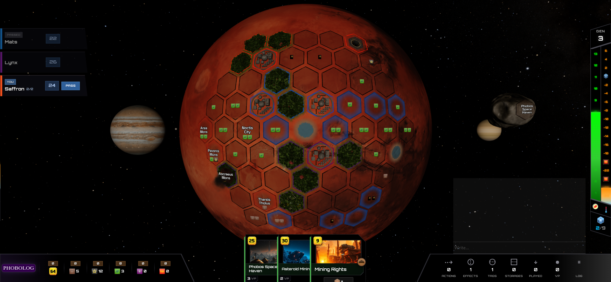
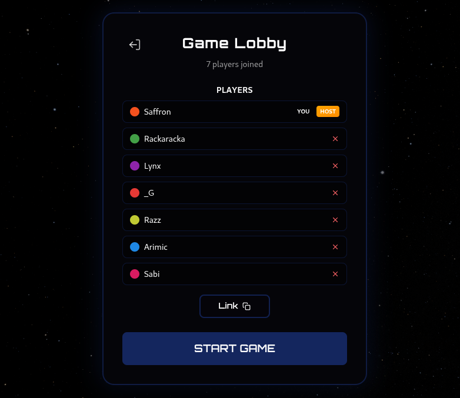

<div align="center">

# Terraforming Mars: Community Edition

**Play the beloved board game online -- with a fully interactive 3D Mars.**

Real-time multiplayer. 450+ cards. Six expansions. One red planet.

[](LICENSE)
[](https://github.com/terraforming-mars-ce/terraforming-mars/stargazers)
[](https://github.com/terraforming-mars-ce/terraforming-mars/issues)
[](https://terraforming-mars-ce.github.io/terraforming-mars/)

</div>

---

> **Disclaimer** -- This is a fan-made, open-source project and is not affiliated with
> FryxGames, Asmodee Digital, or Steam. If you enjoy this, please
> [buy the physical board game](https://www.fryxgames.se/terraforming-mars/) -- it's excellent.

---

<p align="center">
  
</p>

## What is this?

Terraforming Mars: Community Edition is a full digital adaptation of the Terraforming Mars board game, playable in your browser. The Mars surface is rendered as an interactive 3D hex grid -- you rotate, zoom, and place tiles directly on the planet. Games run in real time over WebSockets with no account required.

This is not a simplified clone. It implements the complete rule set across six expansions with hundreds of cards, corporations, milestones, awards, and colonies.

## Features

<div align="center">
<video src="https://github.com/user-attachments/assets/7eee7911-c1c0-4e1f-af88-586b25247703" width="100%" autoplay loop muted></video>
</div>

**3D Interactive Board** -- A real-time rendered Mars surface built with Three.js and React Three Fiber. Rotate, zoom, and watch the planet transform as oceans fill, greenery spreads, and cities rise.

<div align="center">
<video src="https://github.com/user-attachments/assets/86e3f2a1-7f65-4c93-aaa0-8d706eaf9585" width="100%" autoplay loop muted></video>
</div>

**450+ Cards Across 6 Expansions** -- Base game, Corporate Era, Prelude, Venus Next, Colonies, and Turmoil. Each card's behavior is fully implemented with triggers, production chains, and conditional effects.



**Real-time Multiplayer** -- WebSocket-powered sessions with instant state sync. Create a game, share the code, and play. Supports reconnection if you drop -- your game state is preserved.

**Sound and Animation** -- Asteroid impacts, tile placement effects, animated resource counters, and ambient audio bring the experience to life beyond a static board.

## Quick Start

```bash
git clone https://github.com/terraforming-mars-ce/terraforming-mars.git
cd terraforming-mars
make dev-setup   # Install dependencies
make run         # Launch frontend (3000) + backend (3001)
```

Open `http://localhost:3000`, create a game, and invite friends with the game code.

## Tech Stack

| Layer    | Technology                              |
|----------|-----------------------------------------|
| Frontend | React, TypeScript, Three.js / R3F, Tailwind CSS |
| Backend  | Go, Gorilla WebSocket, Chi router       |
| Tooling  | Tygo (Go-to-TS codegen), Air (hot reload) |

## Contributing

Contributions are welcome. The codebase is split into a Go backend (`backend/`) and a React frontend (`frontend/`), connected by auto-generated TypeScript types.

```bash
make test        # Run backend tests
make lint        # Lint Go + TypeScript
make format      # Format everything
```

See the `Makefile` for the full command reference.

## License

MIT -- see [LICENSE](LICENSE) for details.

---

<div align="center">

*Not affiliated with FryxGames or Asmodee Digital.*

</div>
