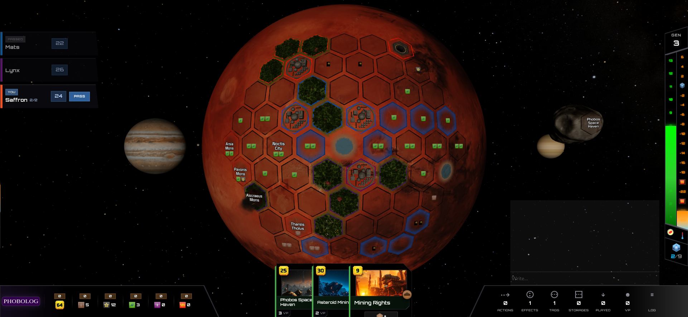
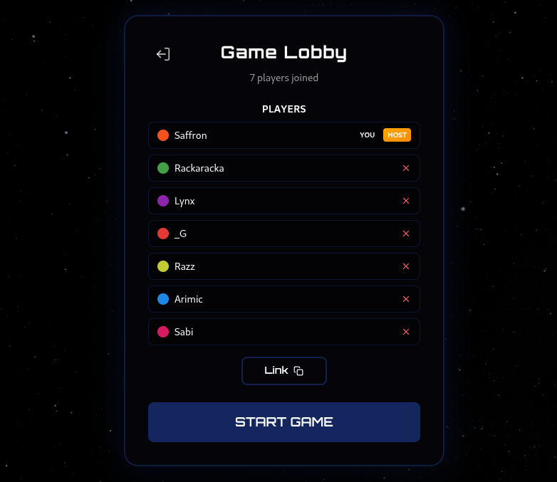

<div align="center">

# Open Mars

**Play the beloved board game online with a fully interactive 3D Mars.**

Real-time multiplayer. 450+ cards. Six expansions. One red planet.

[](LICENSE)
[](https://github.com/openmars-app/openmars/stargazers)
[](https://github.com/openmars-app/openmars/issues)
[](https://openmars-app.github.io/openmars/)

**Original soundtrack by [Lucas](mailto:lucas.gussua@gmail.com)** -- thank you for scoring the red planet.

</div>

---

> **Disclaimer** -- This is a fan-made, open-source project and is not affiliated with
> FryxGames, Asmodee Digital, or Steam. If you enjoy this, please
> [buy the physical board game](https://www.fryxgames.se/terraforming-mars/) -- it's excellent.

---

<p align="center">
  
</p>

## What is this?

Open Mars is a digital board game based on Terraforming Mars, playable in your browser. The Mars surface is rendered as an interactive 3D hex grid -- you rotate, zoom, and place tiles directly on the planet. Games run in real time over WebSockets with no account required.

This is not a simplified clone. It implements the complete rule set across six expansions with hundreds of cards, corporations, milestones, awards, and colonies.

## Features

<div align="center">
<video src="https://github.com/user-attachments/assets/7eee7911-c1c0-4e1f-af88-586b25247703" width="100%" autoplay loop muted></video>
</div>

**3D Interactive Board** -- A real-time rendered Mars surface built with Three.js and React Three Fiber. Rotate, zoom, and watch the planet transform as oceans fill, greenery spreads, and cities rise.

<div align="center">
<video src="https://github.com/user-attachments/assets/86e3f2a1-7f65-4c93-aaa0-8d706eaf9585" width="100%" autoplay loop muted></video>
</div>

**450+ Cards Across 6 Expansions** -- Base game, Corporate Era, Prelude, Venus Next, Colonies, and Turmoil. Each card's behavior is fully implemented with triggers, production chains, and conditional effects.



**Real-time Multiplayer** -- WebSocket-powered sessions with instant state sync. Create a game, share the code, and play. Supports reconnection if you drop -- your game state is preserved.

**Sound and Animation** -- Asteroid impacts, tile placement effects, animated resource counters, and ambient audio bring the experience to life beyond a static board.

## Quick Start

```bash
git clone https://github.com/openmars-app/openmars.git
cd openmars
just deps        # Install dependencies
just dev         # Launch frontend (3000) + backend (3001)
```

Requires [Go](https://go.dev), [Bun](https://bun.sh), [Node](https://nodejs.org) 24+ and [just](https://just.systems).

Open `http://localhost:3000`, create a game, and invite friends with the game code.

## Tech Stack

| Layer    | Technology                              |
|----------|-----------------------------------------|
| Frontend | React, TypeScript, Three.js / R3F, Tailwind CSS |
| Backend  | Go, Gorilla WebSocket, Chi router       |
| Tooling  | Tygo (Go-to-TS codegen), Air (hot reload) |

## Contributing

Contributions are welcome. The codebase is split into a Go backend (`backend/`) and a React frontend (`frontend/`), connected by auto-generated TypeScript types.

```bash
just test               # Run backend tests
just lint               # Lint Go + TypeScript
just format             # Format everything
just prepare-for-commit # Format, regenerate types and run every CI check
```

Run `just` for the full command reference.

## License

MIT -- see [LICENSE](LICENSE) for details.

---

<div align="center">

*Not affiliated with FryxGames or Asmodee Digital.*

</div>
